# IT服务工单系统PRD

## 一、功能规格说明清单

| 编号 | 功能名称 | 触发条件 | 前置 / 后置 | 模块名称 |
|---|---|---|---|---|
| P0  F-01 | 统一工单提交入口 | 提交工单 | 字段校验（前置）；校验通过 → 生成工单（后置） | 工单提交 |
| P0  F-02 | 工单状态变更自动通知 | 工单状态每次变化时（提单成功、派单、待验收、验收通过/驳回、超时） | 提单成功、身份校验（前置）；<br />消息重发（后置） | 消息通知 |
| P1  F-03 | 高频问题沉淀知识库智能推荐（拆分） | 分类选中后描述自动匹配 | 知识库存在条目（前置）；<br />命中显示推荐卡、未命中不显示（后置） | 智能推荐卡 |
| P1  F-04 | 提单前智能客服咨询（AI 客服＋人工兜底） | 员工提交工单前点击「咨询客服」发起对话 | 已登录且知识库语料就绪（前置）；<br />AI 解决 → 会话归档不提单、未解决 → 一键转人工客服→ 携带对话记录跳转提单页自动回填（后置）； | 智能客服 |

## 二、业务流程泳道图设计


## 三、界面与交互设计

### 1.界面原型图

1.1登录界面

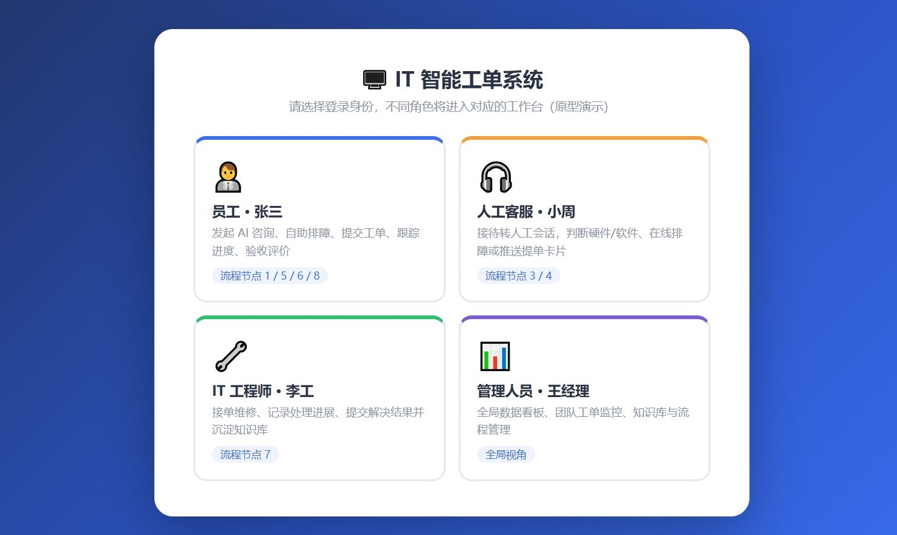 

 

1.2员工（发起咨询）

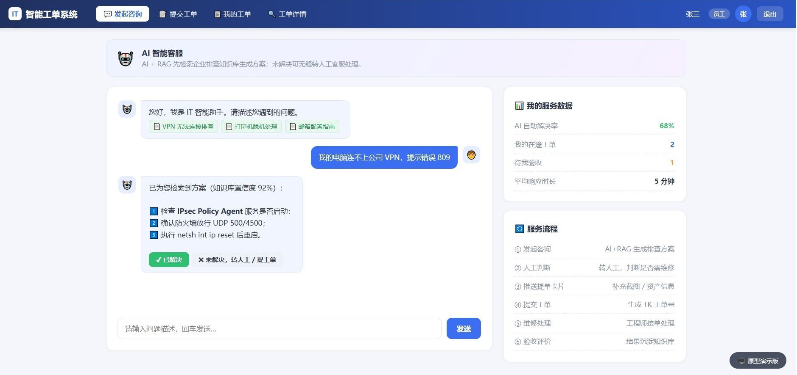 

 

1.3员工（提交工单）

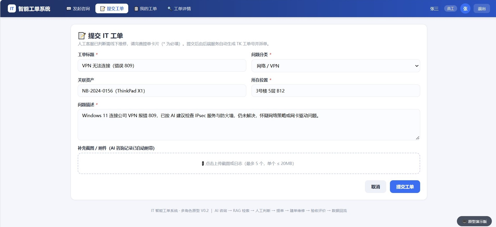 

 

1.4员工（我的工单）

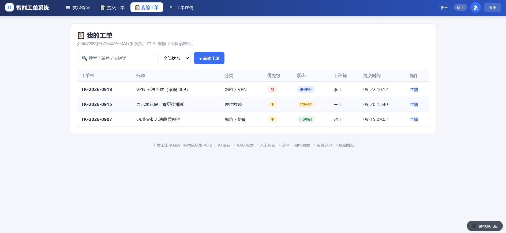 

 

 

 

 

 

1.5员工（工单详情）

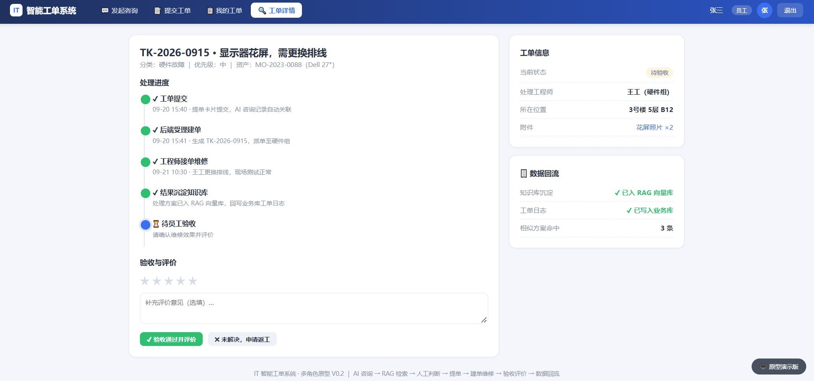 

 

2.1 IT工程师（工单池）

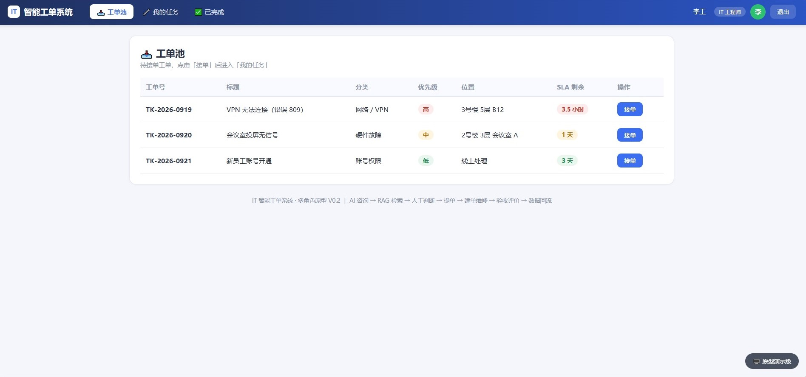 


2.2 IT工程师（我的任务）

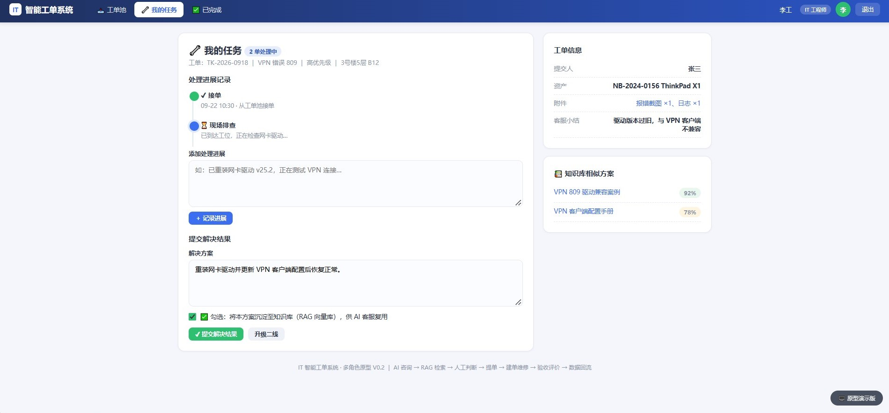 

 

2.3 IT工程师（已完成）

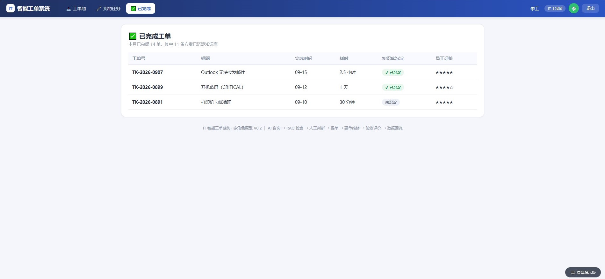 


3.1 人工客服（会话队列）

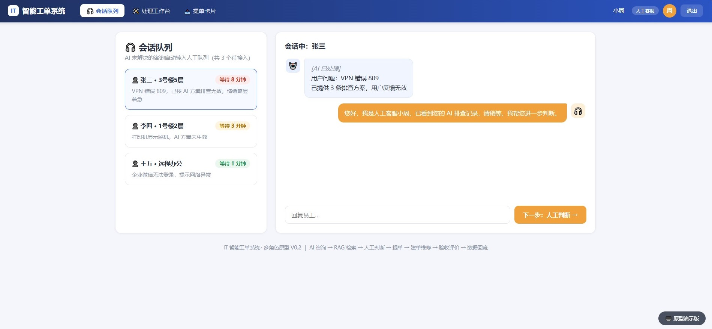 

 

 

3.2 人工客服（处理工作台）

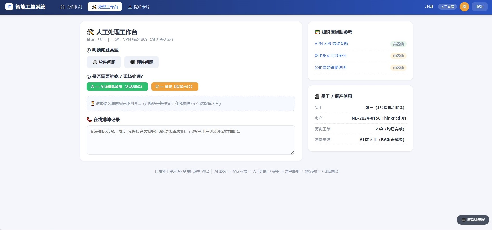 


3.3 人工客服（提单卡片）

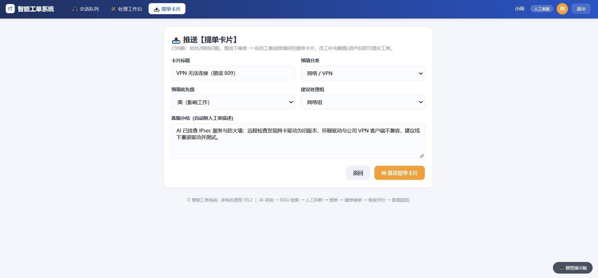 

 

4.1 管理人员（数据看板）

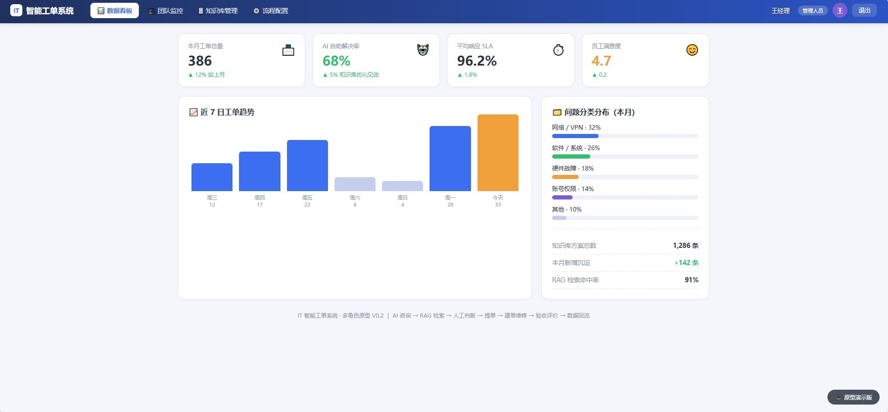 


4.2 管理人员（团队监控）

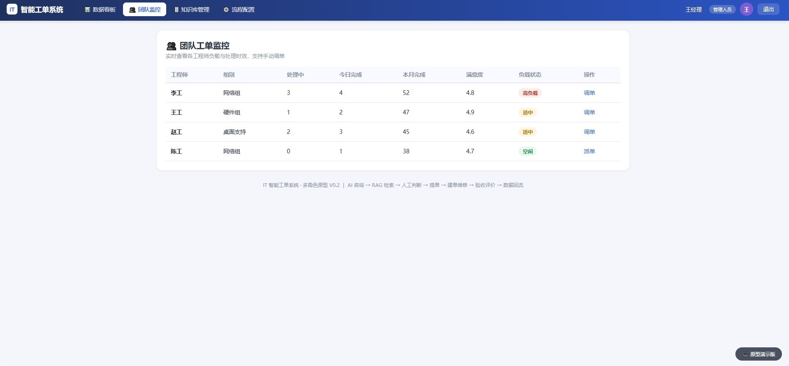 

 

4.3 管理人员（知识库管理）

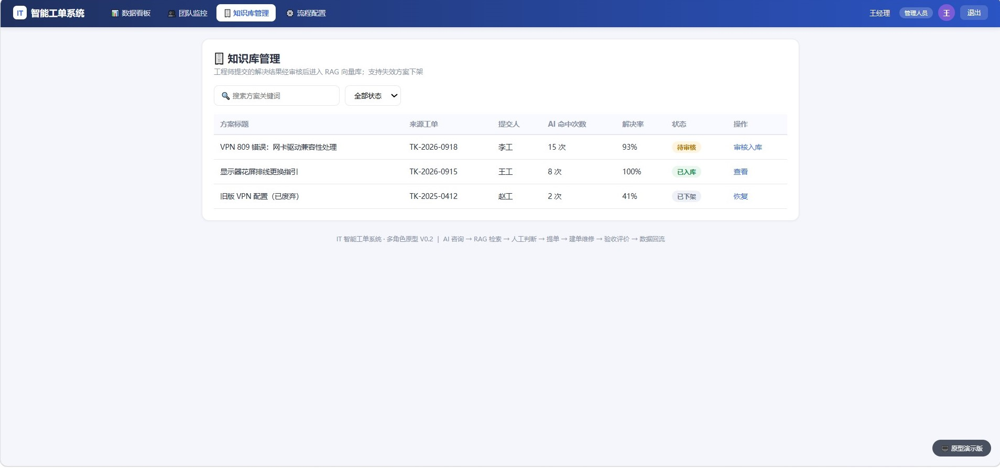 


4.4 管理人员（流程配置）

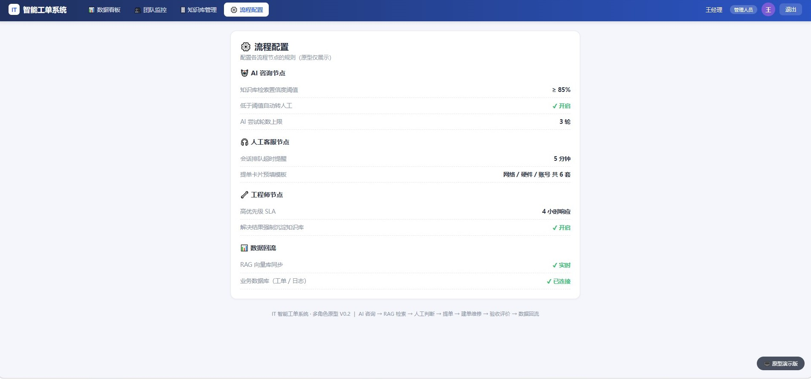 

### 2. 字段级校验与交互反馈表

适用页面：工单提交页（F-01 统一工单提交入口），字段英文标识与第四章 Data Model 完全保持一致。

| 字段 / 元素名 | 控件类型 | 校验规则（必填 / 长度 / 正则） | 默认值 | 交互反馈与提示 |
|---|---|---|---|---|
| 工单标题<br>title | 文本输入框 | 必填，1–50 字符 | 空 | 失焦为空时字段下方红字：「请填写工单标题」；右下角实时字数 12/50 |
| 工单类型<br>category | 单选枚举 Chip 组 | 必填，值域 HARDWARE / SOFTWARE / NETWORK / ACCOUNT / OTHER | 无默认选中 | 选中后 300ms 防抖调用知识库推荐；未选中时提交拦截并定位到该字段 |
| 优先级<br>priority | 单选枚举 Chip 组 | 必填，值域 HIGH / MEDIUM / LOW | MEDIUM（中） | 选中「高」时下方提示：「高优先级将同步短信通知，请确认确为紧急故障」 |
| 问题描述<br>description | 多行文本框 | 必填，10–500 字符 | 空（带引导占位符） | 不足 10 字时提交按钮置灰并提示「请至少填写 10 个字，说明何时开始、报错原文、已尝试的操作」；超 500 字截断并飘红 |
| 截图附件<br>attachment_urls | 文件拖拽 / 粘贴 / 按钮 | 选填，jpg/png，单张 ≤ 5MB，最多 3 张 | 空 | 格式不符 Toast：「仅支持 jpg/png 格式」；超限 Toast：「单张不超过 5MB，最多上传 3 张」；上传中显示进度条，成功后列出文件名与删除按钮 |
| 期望完成时间<br>expected_finish_time | 日期时间选择器 | 选填，格式 YYYY-MM-DD HH:mm:ss，须 ≥ 当前系统时间 | 空 | 选中过去时间时禁止确认并提示「期望完成时间不能早于当前时间」；日历中今日之前的日期置灰 |
| 资产编号<br>asset_id | 文本输入框 + 扫码 | 选填；类型为「硬件」时建议必填；正则 ^IT-[A-Z]{2,4}-\d{8}$ | 空（可扫码填入） | 失焦调 CMDB 校验，查无此编号时提示：「未在资产库中找到该编号，请核对设备标签」；校验通过时在下方显示设备型号与责任人 |
| 知识库推荐卡<br>recommend_list | 只读推荐列表 | 非输入项；has_recommendation=false 时整卡不渲染 | P0 阶段不展示 | 接口 > 2 秒超时或异常时静默隐藏整卡，不弹错误框、不阻塞提单；搜索词异步写入未决日志库。点击条目在新标签打开知识库文章 |
| 提交工单按钮<br>submit | 操作主按钮 | 必填项未齐时置灰；防重复点击（Debounce 3 秒） | 置灰不可点 | 点击后变 Loading 状态「提交中…」，成功跳转提交成功页，失败 Toast：「提交失败，请稍后重试」并恢复可点 |
| 存草稿按钮<br>save_draft | 次级按钮 / 自动保存 | 无校验，允许任意残缺内容 | 每 30 秒自动保存一次 | 保存后按钮旁显示「草稿已自动保存 14:22」；下次进入提单页提示「检测到未提交的草稿，是否恢复？」 |

**字段级校验（三道防线模型）：**

第一道 失焦即时校验——单字段必填 / 长度 / 正则即时反馈；第二道 提交前全量校验——拦截并定位首个错误字段；第三道 服务端二次校验——防前端绕过，返回字段级错误码列表，前端逐项标红。

**异常路径：**

| 异常场景 | 系统行为 | 用户感知 |
|---|---|---|
| 网络超时 / 服务端 5xx | 前端自动重试 1 次，仍失败则 Toast 并恢复按钮可点 | 「提交失败，请稍后重试」，已填内容不丢失 |
| 重复点击 / 双击提交 | 3 秒防抖 + 服务端幂等键去重 | 仅生成一张工单，无重复 |
| 服务端校验不通过 | 返回字段级错误列表，前端逐项标红并定位 | 首个错误字段高亮聚焦 |
| 登录会话过期 | 401 跳转登录页，草稿每 30 秒自动保存 | 重新登录后提示恢复草稿 |

**验收标准（AC）：**

- AC1：必填项未齐时提交按钮置灰；点击提交时定位首个错误字段并红字提示；
- AC2：快速双击 / 重复提交仅生成 1 张工单（幂等键一致返回原工单号）；
- AC3：提交成功 3 秒内跳转成功页并展示工单号，提单成功通知 1 分钟内送达；
- AC4：刷新或重进提单页可恢复 30 秒内自动保存的草稿；
- AC5：断网恢复后重试提交成功，服务端仅保留一条工单记录与一条流转日志。
#### 2.1 状态表

| 状态值 | 中文名 | 含义 | 终态 |
|---|---|---|---|
| CREATED | 待派单（待领取池） | 提单成功，等待派单/工程师自取 | 否 |
| ASSIGNED | 处理中 | 已有归属工程师，正在处理 | 否 |
| PENDING_SUPPLEMENT | 待补充 | 等提单人补充信息 | 否 |
| PENDING_EXTERNAL | 待外部 | 等外部条件（备件/厂商/运营商） | 否 |
| PENDING_ACCEPTANCE | 待验收 | 方案已提交，等提单人验收 | 否 |
| ACCEPTED | 已完成 | 验收通过 | 是 |
| REJECTED | 已驳回 | 验收不通过，待返工 | 否（回退态） |
| CLOSED | 已关闭 | 撤销/重复单/异常关单/超时关闭 | 是 |

#### 2.2 流转表

| 当前状态 | 触发事件 | 下一状态 | 操作角色 | 守卫条件 | 联动动作 |
|---|---|---|---|---|---|
| （起点） | 提交工单（F-01） | CREATED | 员工 | 三道校验通过 + 幂等去重 | 写首条流转日志；通知提单人＋待领取池工程师 |
| CREATED | 主管派单 / 工程师 自取 | ASSIGNED | 主管 / 工程师 | 工单在待领取池 | 通知双方； |
| ASSIGNED | 请求补充信息 | SUPPLEMENT | 工程师 | 待补充内容必填 | 通知提单人； |
| PENDING_SUPPLEMENT | 提单人提交补充 | ASSIGNED | 提单人 | 补充内容非空 | 通知工程师； |
| ASSIGNED | 挂起等待外部 | EXTERNAL | 工程师 | 外部原因＋预计时长必填 | 通知提单人； |
| PENDING_EXTERNAL | 外部条件就绪 | ASSIGNED | 工程师 | — | 通知工程师； |
| ASSIGNED | 提交解决方案 | ACCEPTANCE | 工程师 | 解决方案非空 | 通知提单人验收；启动 48h 验收超时计时 |
| PENDING_ACCEPTANCE | 验收通过（含评价） | ACCEPTED | 提单人 | — | 通知工程师； |
| PENDING_ACCEPTANCE | 验收超时自动通过 | ACCEPTED | 系统 | 超时阈值 48h（可配置） | 同上，标记 auto_accepted |
| PENDING_ACCEPTANCE | 验收驳回 | REJECTED | 提单人 | 驳回原因必填 | 通知工程师 |
| REJECTED | 重新处理 | ASSIGNED | 工程师 | — | 通知提单人； |
| CREATED | 提单人撤销 / 主管关重复单 | CLOSED | 提单人 / 主管 | 未被领取 | 通知相关人 |
| ASSIGNED / PENDING_* | 异常关单 | CLOSED | 主管 | 关单原因必填 | 通知双方； |
| PENDING_SUPPLEMENT | 超时未补充自动关闭 | CLOSED | 系统 | 超时阈值 72h（可配置） | 通知双方 |

## 四、数据定义与AI Agent / API 接口约定

### 1. 关键主数据字段 (Data Model)

| 字段名称 | 英文标识 (Field) | 数据类型 | 约束 / 索引 | 业务规则与说明 |
|---|---|---|---|---|
| 工单 ID | ticket_id | String(32) | 主键 (PK) | 雪花算法/唯一业务流水号 (如 TK202609180001) |
| 工单标题 | title | String(50) | 非空 | 1–50 字符，用于列表页展示、通知模板及详情页 |
| 资产 ID / 电脑 ID | asset_id | String(64) | 普通索引 | 终端设备资产编号（如 IT-PC-20260901），锁定具体电脑，联动 CMDB |
| 提单人 ID | creator_id | String(32) | 普通索引 | 提单员工工号/账户 ID |
| 工单类型 | category | Enum | 非空 | HARDWARE, SOFTWARE, NETWORK, ACCOUNT, OTHER |
| 问题描述 | description | String(500) | 非空 | 长度限制 10~500 字符，提单核心详情描述 |
| 截图附件 | attachment_urls | JSON / List | 选填 | 存储图片 OSS/S3 访问 URL，限 jpg/png，单张 ≤5MB，最多 3 张 |
| 优先级 | priority | Enum | 非空 | HIGH (高), MEDIUM (中), LOW (低)，默认 MEDIUM |
| 期望完成时间 | expected_finish_time | Datetime | 选填 | 格式 YYYY-MM-DD HH:mm:ss，必须 ≥ 当前时刻 |
| 工单流转状态 | ticket_status | Enum | 索引 | CREATED, ASSIGNED, EXTERNAL, ACCEPTANCE, REJECTED, CLOSED |
| 处理人 ID | assignee_id | String(32) | 普通索引 | 当前分配的 IT 运维工程师工号，可空 |
| 通知幂等键 | notify_dedup_key | String(64) | 唯一/联合索引 | 格式：{ticket_id}:{event_type}，用于 1 分钟防重 |

### 2. AI Agent / API 接口汇总表

类型约定：请求参数与输出契约中未标注类型的字段默认为 String；括号内为枚举值域或补充说明；（选填）= 非必传。

| 接口名称 | 对应功能 / 触发时机 | 请求参数 | 输出契约 (data) | 降级兜底方案                    (Fallback) |
|---|---|---|---|---|
| 提交工单<br>POST /api/tickets | F-01 员工点击「提交工单」（前端全量校验通过后） | idempotency_key / creator_id / title / category / priority / description / asset_id（选填）/ attachment_urls[]（选填）/ expected_finish_time（选填） | ticket_id / ticket_status（CREATED）/ created_at / duplicate（幂等命中=true，返回原工单号） | 超时或 5xx：前端携带同一幂等键自动重试 1 次，绝不重复建单；仍失败 Toast 提示且表单内容保留；主记录与首条流转日志事务同写，失败整体回滚 |
| 草稿保存<br>POST /api/tickets/draft | F-01 提单页每 30 秒自动保存，或点击「存草稿」 | creator_id / draft_payload（表单字段快照）/ client_saved_at | draft_id / saved_at | 失败时静默写入浏览器 localStorage 兜底，网络恢复后自动重传；不阻塞提单主流程 |
| 附件上传<br>POST /api/files/upload | F-01 拖拽/粘贴/选择图片时逐张上传 | file（jpg/png，单张 ≤5MB，最多 3 张）/ creator_id / biz_type（TICKET） | file_url / file_size / upload_status（SUCCESS/FAILED） | 单张失败标红可重传或删除，不阻塞其余附件与提单；存储不可用时允许先提交、稍后补传 |
| CMDB 资产校验<br>GET /api/cmdb/assets/{asset_id} | F-01 资产编号失焦时触发 | asset_id（路径参数） | exists / device_model / owner_name | CMDB 超时（>2s）不阻塞提单，工单记录「资产待核对」标记，工程师处理时补验 |
| 全节点自动通知<br>POST /api/notify/dispatch | F-02 工单状态变更事件触发 | ticket_id / event_type / receiver_id / priority / template_params | ticket_id / channel_used / is_fallback / delivery_status | 企微推送失败（>3s）：HIGH 触发短信兜底；低/中级仅重试。Redis 锁（TTL 60s）防重复推送 |
| 知识库相似推荐<br>POST /api/kb/recommend | F-03（在 F-01 提单页内触发）类型选中且描述停顿 300ms 后 | creator_id / asset_id / category / description / system_stage | has_recommendation / recommend_list[]（article_id、title、similarity_score、solution_summary） | 超时（>2s）或检索异常：前端静默隐藏推荐卡；MQ 异步将搜索词与资产号入库，提单 100% 可用 |
| FAQ 自动生成<br>POST /api/kb/faq/generate | F-03 工单验收通过（ACCEPTED）后异步触发 | ticket_id / category / title / solution_text / asset_id（选填） | faq_id / faq_status（DRAFT）/ merged / similarity_group_id | 失败仅记入归档候选队列重试，不影响关单；DRAFT 须主管审核入库（人机回环）；相似度过高自动合并，防知识库污染 |
| 智能客服对话<br>POST /api/ai-cs/chat | F-04 员工提单前发起咨询会话（多轮，每轮提问触发） | session_id / creator_id / message / context_refs（asset_id、category） | reply_type（ANSWER/CLARIFY/REFUSE）/ answer_text / source_article_ids[] / confidence / suggest_transfer | 超时（>3s）或低置信：返回 REFUSE 话术并置顶「转人工」按钮；检索异常降级为分类 FAQ 静态列表，提单入口全程可用 |
| 转人工客服<br>POST /api/ai-cs/transfer | F-04 手动点击「转人工」，或命中兜底策略 R1-R6 触发 | trigger_type（MANUAL/RULE_SUGGESTED/RULE_FORCED）/ session_id / creator_id / chat_summary / priority_hint | agent_id / queue_position / estimated_wait_sec / transfer_status（CONNECTED/QUEUED/OFFLINE） | 坐席全忙/非在线：留言队列+企微通知客服组长，展示「直接提单」入口，对话记录自动回填工单；转接失败重试 2 次后落提单入口 |

### 3. JSON 响应示例

**• 提交工单（POST /api/tickets）响应报文：**

```json
{
  "code": 200,
  "msg": "success",
  "data": {
    "ticket_id": "TK202609220017",
    "ticket_status": "CREATED",
    "created_at": "2026-09-22 18:05:30",
    "duplicate": false
  }
}
```

**• 草稿保存（POST /api/tickets/draft）响应报文：**

```json
{
  "code": 200,
  "msg": "success",
  "data": {
    "draft_id": "DF20260922003",
    "saved_at": "2026-09-22 18:06:12"
  }
}
```

**• 附件上传（POST /api/files/upload）响应报文：**

```json
{
  "code": 200,
  "msg": "success",
  "data": {
    "file_url": "https://oss.example.com/ticket/20260922/img_01.png",
    "file_size": 843212,
    "upload_status": "SUCCESS"
  }
}
```

**• CMDB 资产校验（GET /api/cmdb/assets/{asset_id}）响应报文：**

```json
{
  "code": 200,
  "msg": "success",
  "data": {
    "exists": true,
    "device_model": "ThinkPad T14 Gen 1",
    "owner_name": "张三"
  }
}
```

**• 工单状态变更自动通知（POST /api/notify/dispatch）响应报文：**

```json
{
  "code": 200,
  "msg": "success",
  "data": {
    "ticket_id": "TK202609180001",
    "channel_used": "WECHAT_WORK",
    "is_fallback": false,
    "delivery_status": "SUCCESS"
  }
}
```

**• 知识库相似推荐（POST /api/kb/recommend）响应报文：**

```json
{
  "code": 200,
  "msg": "success",
  "data": {
    "has_recommendation": true,
    "recommend_list": [
      {
        "article_id": "KB_10204",
        "title": "办公网 VPN 无法认证排查指引",
        "similarity_score": 0.89,
        "solution_summary": "请先检查数字证书是否过期，或尝试重启 AnyConnect 客户端服务进程..."
      }
    ]
  }
}
```

**• FAQ 自动生成（POST /api/kb/faq/generate）响应报文：**

```json
{
  "code": 200,
  "msg": "success",
  "data": {
    "faq_id": "FAQ_20311",
    "faq_status": "DRAFT",
    "merged": false,
    "similarity_group_id": "SG_88"
  }
}
```

**• 智能客服对话（POST /api/ai-cs/chat）响应报文：**

```json
{
  "code": 200,
  "msg": "success",
  "data": {
    "session_id": "CS20260922001",
    "reply_type": "ANSWER",
    "answer_text": "请先检查数字证书是否过期，或尝试重启 AnyConnect 客户端服务进程……",
    "source_article_ids": [
      "KB_10204"
    ],
    "confidence": 0.87,
    "suggest_transfer": false
  }
}
```

**• 转人工客服（POST /api/ai-cs/transfer）响应报文：**

```json
{
  "code": 200,
  "msg": "success",
  "data": {
    "session_id": "CS20260922001",
    "agent_id": "CS_AGENT_07",
    "queue_position": 2,
    "estimated_wait_sec": 180,
    "transfer_status": "QUEUED"
  }
}
```
