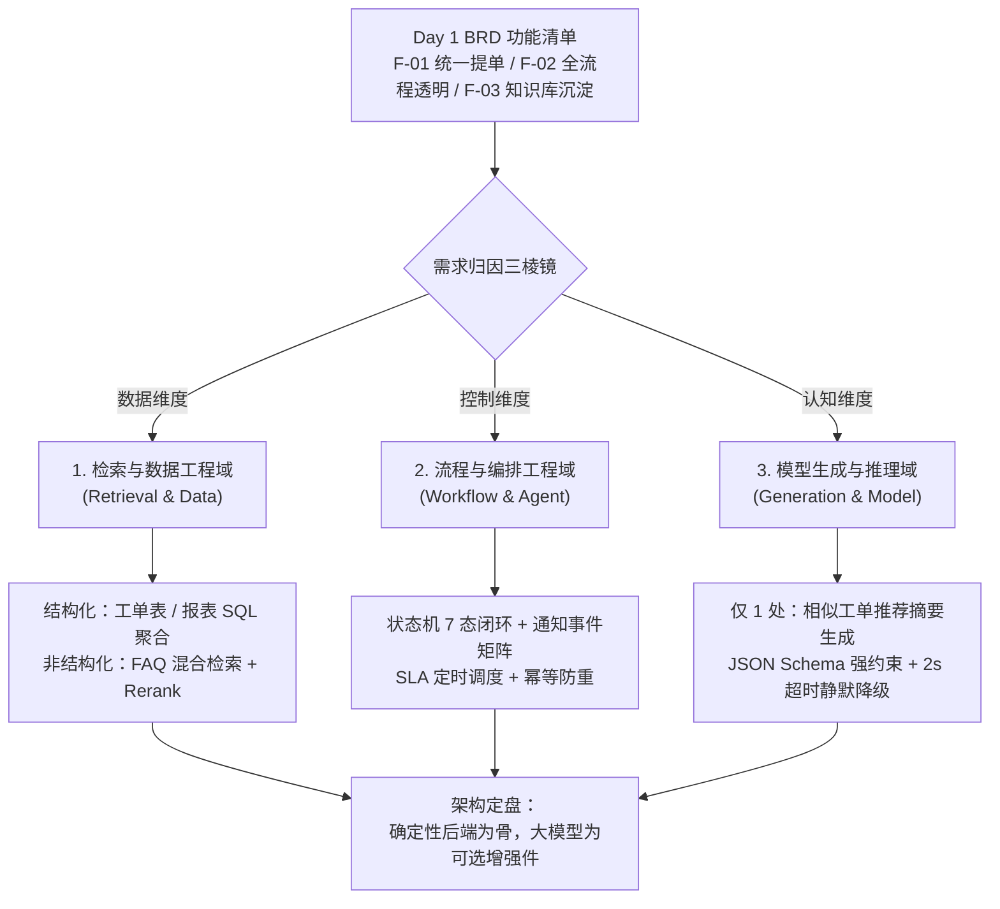

# 企业 IT 服务工单系统 —— 需求归因

BRD 里写的 F-01/F-02/F-03，真正需要大模型的只有 F-03 的"相似历史工单推荐"。F-01 的表单校验、F-02 的状态机流转、Roadmap 里的 SLA 预警与报表统计，全部是确定性后端逻辑，不需要模型调用, 据此进行改造项目。

### 1.1 归因三棱镜总览

---

## 1. 承接 Day 1 BRD：功能清单与 PRD 落地状态盘点

| 编号 | BRD / Roadmap 功能点 | PRD 对应章节 | 落地状态 | 归因主属性 |
| :--- | :--- | :--- | :--- | :--- |
| **F-01** | 统一工单提交入口（分类 + 描述 + 截图 + 优先级） | PRD 三.2 字段级校验表 | 已实现（含 title/category 全字段校验 + 草稿自动保存 + 3s 防抖） | **流程与编排域**（表单校验 + 幂等提交） |
| **F-02** | 工单全流程透明化 + 全节点自动通知 | PRD 二.泳道图、三.3 通知事件矩阵 | 已实现（7 态闭环 + 8 类事件通知 + 1 分钟幂等防重） | **流程与编排域**（状态机 + 事件编排） |
| **F-03** | 高频问题沉淀知识库 + 提单时智能推荐 | PRD 四.2 `POST /api/kb/recommend` | 已定义契约，推荐能力待接入 | **检索与数据域**（混合检索）+ 微量生成域 |
| **P0-1** | 工单统计报表（分类 / 状态分布） | PRD 四.1 Data Model | 库表字段已预留（solved_at / rating_score） | **检索与数据域（结构化）** |
| **P0-2** | 全节点通知 | 同 F-02 | 已实现 | **流程与编排域** |
| **P1-1** | 高频问题库（已关闭工单归档 FAQ + 相似推荐） | 同 F-03 | 待建 | **检索与数据域** |
| **P1-2** | SLA 预警（按优先级设时限，超时自动升级） | PRD 三.3 `TIMEOUT_ALERT` 事件 | 规则已写、定时器未挂 | **流程与编排域** |
| **P1-3** | 自动派单引擎 | 当前靠工程师手动 claim | 待建 | **流程与编排域**（规则引擎，非模型） |

---

## 2. 功能全景三维矩阵表（FDE 全盘三维审查）

| 业务功能清单 （来自 BRD）                            | 维度一：检索与数据工程域 *（查什么数据？什么格式？）*     | 维度二：流程与编排工程域 *（几步状态流转？有高危写操作吗？）* | 维度三：模型生成与推理域 *（下游怎么消费？怎么防崩坏？）* |
| :------------------------------------------------------ | :----------------------------------------------------------- | :----------------------------------------------------------- | :----------------------------------------------------------- |
| **功能 A：工单智能受理** （F-01）                    | 报错截图 OCR 与版面解析；比对 CMDB 资产主数据表              | 重复工单拦截与状态流转；信息不全时挂起待人工确认             | JSON Schema 约束输出；Few-shot 规范化分类与优先级取值        |
| **功能 B：IT 政策与故障咨询** （F-03）               | FAQ 按「现象 / 排查 / 方案」分块（20% Overlap）；BM25 + 向量混合检索 + Rerank | 前置意图路由（区分政策咨询与报修提单）；无答案时拒答并转人工 | 强约束必须引用知识库条目编号；严禁发散猜测                   |
| **功能 C：进度查询与统计** （P1 报表 + P2 对话查询） | 工单系统只读 API 实时查进度；Text2SQL 查处理时长与工作量统计 | 提单人 / 工程师 / 主管权限校验（越权不可查）；慢查询超时熔断 | 将状态与数值数组转为员工可读的进度时间线 / 趋势摘要          |
| **功能 D：自动派单与反馈** （F-02 + P1 自动派单）    | 实时查询工程师技能表、在岗状态与在手工单负荷；关联 CMDB 设备责任人 | 强制 Human-in-the-Loop 人机确认（派单草案主管点击才生效）；派单幂等防重与失败补偿 | 自动撰写员工可读的进展话术；提炼主管超时处理简报             |

---

## 3. 三维全景透视（AI 相关功能的深度展开）

### 3.1 深度透视：【F-03 高频问题库与相似工单推荐】

**1）检索与数据工程域（输入什么数据与凭证）**

语料来源：已关闭工单的「标题 + 分类 + 问题描述 + 最终解决方案」，必须脱敏（剔除员工姓名、工号、资产编号、内网 IP）；

切分策略：按「问题现象 / 排查步骤 / 解决方案」三段式结构化切分，禁止机械按 500 字定长切分（会切断操作步骤的因果链）；

检索链路：BM25 抓分类关键词 → 向量召回 Top20 → BGE-Reranker 重排取 Top3；

**2）流程与编排工程域（经历什么控制与防线）**

触发时机：`category` 选中后 300ms 防抖触发，异步非阻塞；

超时防线：接口 > 2s 超时立即静默隐藏推荐卡，不弹错误框、不阻塞提单（PRD 已定义，这是本系统最漂亮的一条降级设计）；

未决日志：搜索词与资产号异步入 MQ，作为后续 FAQ 选题的语料来源；

点击行为回流：员工点击条目 → 打开知识库文章 → 若未解决则"一键提单并自动带上推荐卡上下文"。

## 改造前后职责对照

| 环节                 | 改造前（纯人工）                                             | 改造后（系统自动 + 人工介入）                                |
| :------------------- | :----------------------------------------------------------- | :----------------------------------------------------------- |
| **工单受理与分类**   | 员工在微信/电话里口头报修，IT 同事凭聊天记录与记忆手工登记；信息缺截图、缺设备号，来回追问 | 结构化表单强制带齐分类、描述、截图、资产编号；提交即校验合规性，资产编号自动比对 CMDB；信息不全或 24h 内重复提单自动挂起转人工确认 |
| **优先级与派单**     | 主管凭印象判断紧急程度，逐个打电话/口头联系维修人员；谁有空谁去 | 按优先级、技能标签与实时在手工单负荷自动生成派单草案；主管一键确认（可改派）后生效；无匹配人员或紧急工单自动升级人工调度 |
| **过程跟踪**         | 员工反复打电话问进度，IT 手动翻聊天记录回复；单子走到哪了没人说得清 | 状态变更自动同步提单人（全节点通知）；SLA 超时自动升级提醒主管；员工在列表页自助查进度，无需打扰任何人 |
| **结果反馈**         | 处理完口头说一声；月底凭记忆估算团队工作量，说不清"该不该加人" | 工程师提交方案后自动流转至待验收；员工在线验收评价；满意度、MTTR、分类分布、工程师工作量由系统自动统计成报表 |
| **异常与高危操作**   | 全靠个人经验，无统一防线；漏单、忘单、责任不清无人发现       | 改派/关闭/驳回等写操作强制走状态机白名单校验；全量流转日志可逐单回溯；超时未补充自动挂起或取消，异常流转实时告警主管 |
| **知识沉淀与复用** ★ | 同类问题反复问，经验只存在老员工脑子里，人一走就断档         | 已关闭工单自动脱敏归档为 FAQ；提单时自动推荐相似历史工单与解决方案摘要 |
