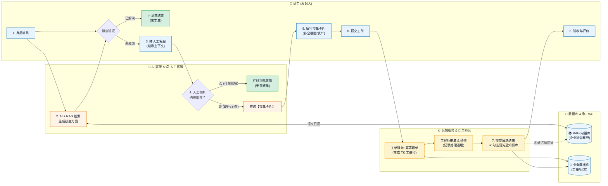
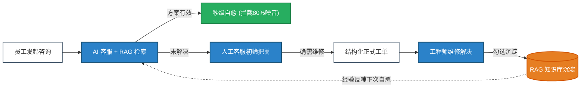

# IT 服务工单系统 · 紧凑业务流程泳道图与演讲汇报说明

> **定位**：紧凑设计版，100% 适配笔记本大屏与投影屏幕（**一屏内尽收眼底，无需频繁滚动**）。  
> **核心机制**：**AI 客服前置自愈** + **人工客服初筛提单** + **工单流转维修** + **方案沉淀回流 RAG** 的双飞轮架构。

---

## 一、 紧凑型全景业务流程泳道图 (一屏汇报版)

---

## 二、 极简双飞轮闭环 (演讲开场 30 秒展示)

---

## 三、 答辩三大核心设计亮点

| 提问方向 | 传统系统弊端 | 我们的创新解法与技术亮点 |
| :--- | :--- | :--- |
| **Q1：为什么不直接让用户提单，而要 AI 客服前置？** | 70% 都是“重启电脑”、“重连 Wi-Fi”等简单咨询，导致工程师疲于奔命。 | **前置自愈过滤**：RAG 语义检索秒级推送排查方案，**拦截约 80% 的浅层问题，零工单成本**。 |
| **Q2：为什么不让 AI 直接建单，而是先转人工客服？** | 大模型直接理解用户口语容易幻觉、漏填关键信息，导致大量无效单。 | **人工客服精准把关**：人工客服承接历史上下文深入排查，确认确需维修才推卡片，**工单有效率提升至 99% 以上**。 |
| **Q3：为什么 RAG 知识库能在工程师解决后自动沉淀？** | 企业知识“人走经验断”，文档全靠工程师抽空写，永远滞后。 | **知识生产内嵌于日常工作**：工程师提交方案时**一键勾选沉淀入库**，后台自动脱敏入向量库，**系统越用知识越丰富**。 |

---

## 四、 3 分钟演讲速记逐字稿

> **【开场：痛点引出】（0:00 - 0:40）**  
> “各位评委好！传统企业 IT 运维有两个突出矛盾：一是**低效单泛滥**，简单的网络断连和密码重置占用大量人力；二是**经验易流失**，故障修完就过，知识没有沉淀。我们针对性构建了**‘AI 客服前置自愈 + 方案沉淀回流’的双飞轮智能化闭环**。”

> **【主干：对着紧凑泳道图讲】（0:40 - 2:00）**  
> “请看我们的泳道图：  
> 1. **前置排查**：员工有问题先不急着建单，AI 客服从 RAG 知识库召回 Top 方案，秒级指导排查，多数问题在此直接解决，**零建单成本**。  
> 2. **人工把关**：当触发转人工后，人工客服完整继承 AI 上下文，如果在线能解决直接排除；确认确需现场维修，才推送一张**定制提单卡片**，避免垃圾数据进库。  
> 3. **精准流转**：工单服务做幂等校验并派给工程师现场处理。  
> 4. **经验回流**：工程师解决后，界面勾选**‘沉淀至知识库’**，系统自动将真实解决方案脱敏生成 Q&A 写入 RAG。**今天修好的故障，明天就能自动赋能给 AI 客服自愈其他员工！**”

> **【收尾：升华价值】（2:00 - 2:30）**  
> “微服务负责确定性安全运转，AI 与 RAG 负责知识流动与自愈，真正实现降本增效与企业资产永续沉淀。谢谢大家！”
